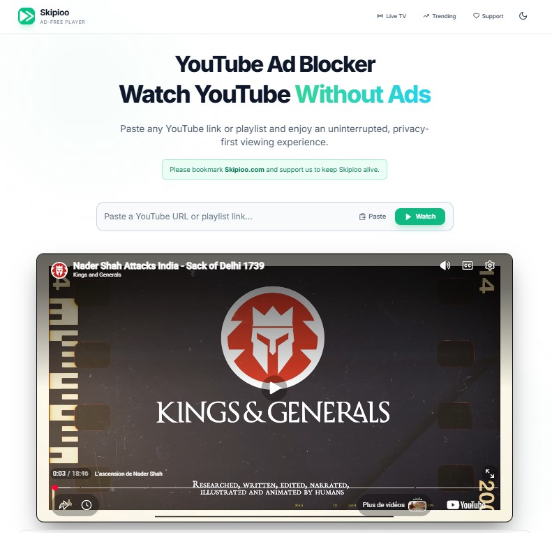

# Skipioo Extension – Watch YouTube Videos on Skipioo

[](LICENSE)
[](https://www.google.com/chrome/)
[](https://www.mozilla.org/firefox/)
[](https://www.microsoft.com/edge/)
[](https://skipioo.com)

> Watch any YouTube video without ads — instantly, with one click.

The **Skipioo Extension** adds a button directly on YouTube video pages. One click opens the current video on [Skipioo.com](https://skipioo.com), the ad-free YouTube player — no account needed, no setup, no interruptions.

---

## ✨ Features

- Adds a **"Watch on Skipioo"** button directly on every YouTube video page
- One click redirects you to the same video on [skipioo.com](https://skipioo.com) — completely ad-free
- Lightweight: no tracking, no background processes, no permissions abuse
- Works on all YouTube video URLs (`youtube.com/watch?v=...`)

---

## Why Use Skipioo?

Skipioo provides a cleaner way to watch YouTube videos.

- Open YouTube videos in a dedicated player
- Fast one-click access
- Minimal interface
- No account required
- Open source extension

---

## 📸 Preview

### YouTube Page


### Skipioo Player




---

## 🚀 Installation (Manual / Developer Mode)

Since this extension is not on the Chrome Web Store, install it manually in a few steps:

1. **Download** the latest `.zip` from the [Releases page](../../releases)
2. **Unzip** the downloaded file
3. Open Chrome and go to `chrome://extensions/`
4. Enable **Developer mode** (toggle in the top-right corner)
5. Click **"Load unpacked"**
6. Select the unzipped extension folder
7. Done! Visit any YouTube video and look for the Skipioo button 🎉

---

## 🔗 How It Works

[Skipioo.com](https://skipioo.com) is an ad-free YouTube player. Any YouTube URL like:

```
https://www.youtube.com/watch?v=dQw4w9WgXcQ
```

Can be watched ad-free at:

```
https://www.skipioo.com/watch?v=dQw4w9WgXcQ
```

This extension automates that for you — no need to manually edit URLs.

---

## 🗂 Project Structure

```
skipioo-extension/
├── manifest.json       # Extension metadata & permissions
├── content.js          # Injects the Skipioo button on YouTube pages
├── icons/
│   ├── icon16.png
│   ├── icon48.png
│   └── icon128.png
└── README.md
```

---

## 🛠 Contributing

Contributions are welcome! Feel free to open an issue or submit a pull request.

1. Fork the repository
2. Create your feature branch: `git checkout -b feature/my-feature`
3. Commit your changes: `git commit -m 'Add my feature'`
4. Push to the branch: `git push origin feature/my-feature`
5. Open a Pull Request

---

## 📄 License

This project is licensed under the **MIT License** — see the [LICENSE](LICENSE) file for details.

---

## 🌐 Links

- 🌍 Website: [skipioo.com](https://skipioo.com)
- 🐛 Issues: [GitHub Issues](../../issues)
- 📦 Releases: [GitHub Releases](../../releases)
